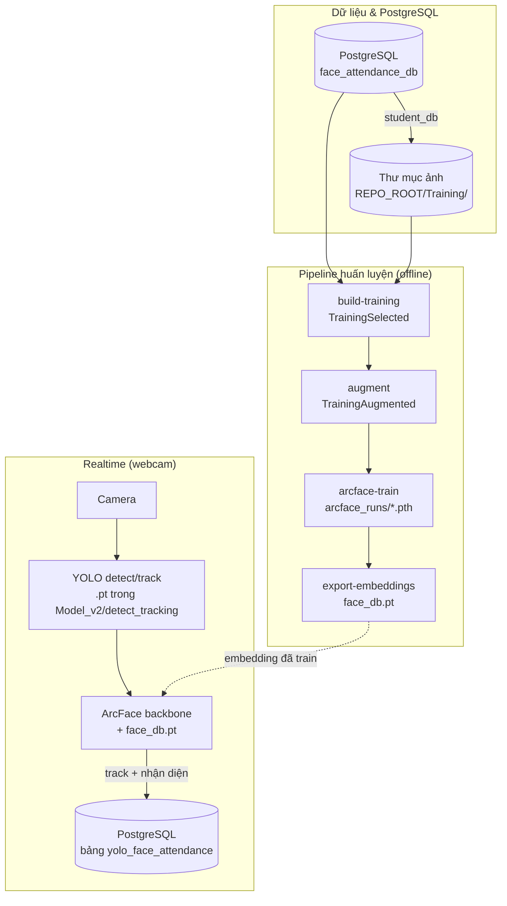
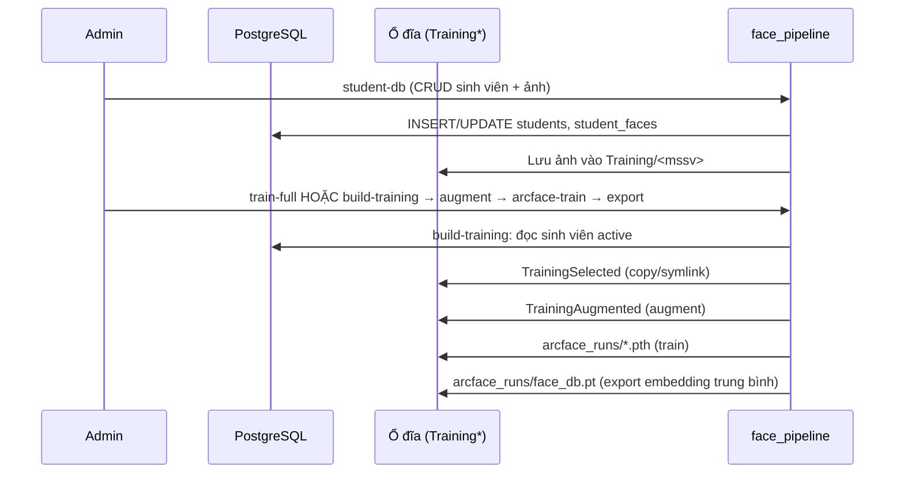
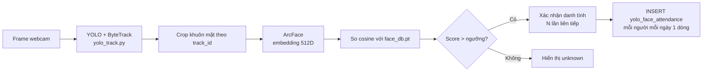

# Hệ thống điểm danh / nhận diện khuôn mặt — Sơ đồ hoạt động & hướng dẫn sử dụng

Tài liệu mô tả **luồng dữ liệu**, **các module**, và **cách chạy lệnh** của project (package `face_pipeline` trong thư mục `Model_v2/`).

---

## 1. Tổng quan

Hệ thống gồm hai nhánh chính:


| Nhánh                                    | Mục đích                                                                                                                                       |
| ---------------------------------------- | ---------------------------------------------------------------------------------------------------------------------------------------------- |
| **Offline (huấn luyện & cơ sở dữ liệu)** | Quản lý sinh viên trên PostgreSQL, đồng bộ ảnh vào thư mục, augment, train **ArcFace**, xuất file embedding `face_db.pt`.                      |
| **Realtime (camera)**                    | **YOLO** (mặc định **v8s-face** cho detect/track; có thể so sánh v8n / v9) phát hiện & theo dõi khuôn mặt → crop → **ArcFace** so khớp embedding → (tuỳ chọn) ghi **điểm danh** vào PostgreSQL. |


---

## 2. Sơ đồ hoạt động (tổng thể)




### 2.1. Luồng huấn luyện (chi tiết)




### 2.2. Luồng realtime điểm danh (chi tiết)




**Lưu ý:** Điểm danh khi chạy `track` ghi vào bảng **`yolo_face_attendance`** (tránh đụng bảng `attendance_records` nếu DB của bạn đã có schema khác, ví dụ cột `session_id`).

---

## 3. Cấu trúc thư mục & module


| Đường dẫn                                             | Vai trò                                                              |
| ----------------------------------------------------- | -------------------------------------------------------------------- |
| `Model_v2/face_pipeline/`                                | Package chính: `detect_tracking`, `recognition`, `data`, `pipeline`. |
| `Model_v2/face_pipeline/paths.py`                        | `REPO_ROOT`, `MODEL_DIR`, tìm file weight `.pt`.                     |
| `Model_v2/face_pipeline/data/pg_settings.py`             | Host/port/db/user/password mặc định, hàm `connect_pg()`.             |
| `Model_v2/face_pipeline/detect_tracking/yolo_webcam.py`  | Chỉ detect + (tuỳ chọn) lưu crop.                                    |
| `Model_v2/face_pipeline/detect_tracking/yolo_track.py`   | Track + nhận diện ArcFace + điểm danh PG.                            |
| `Model_v2/face_pipeline/detect_tracking/yolo_compare.py` | So sánh **yolov8n-face / yolov8s-face / yolov9-c** + metrics.        |
| `Model_v2/face_pipeline/recognition/`                    | ArcFace train, augment, export embedding, recognize 1 ảnh.           |
| `Model_v2/face_pipeline/data/`                           | `student_db_pg`, `build_training_from_db`, `pg_check`.               |
| `Model_v2/*.py`, `Model_v2/detect_tracking/*.py`, …         | **Shim** gọi lại `face_pipeline` (tương thích lệnh cũ).              |


**Weight YOLO (face):** đặt trong `Model_v2/detect_tracking/` hoặc `Model_v2/` (mặc định **detect/track**: `yolov8s-face.pt`; có thể dùng `yolov8n-face.pt`, `yolov9-c.pt`, …).

**Dữ liệu train mặc định:**

- `REPO_ROOT/Training` — ảnh theo sinh viên (thường đồng bộ từ DB).
- `REPO_ROOT/TrainingSelected` — tập đã lọc từ DB (`build-training` / bước 1 của `train-full`).
- `REPO_ROOT/TrainingAugmented` — sau augment.
- `Model_v2/arcface_runs/` — checkpoint ArcFace + `face_db.pt`.

---

## 4. Điều kiện chạy

1. **Python 3.10+** (khuyến nghị; project có thể dùng 3.13).
2. Gói chính: `torch`, `torchvision`, `ultralytics`, `opencv-python`, `Pillow`, `psycopg2-binary`.
3. **PostgreSQL** đã tạo database (mặc định cấu hình code: `face_attendance_db`).
4. Chạy CLI: **`cd modelcore/Model_v2`** rồi dùng `python -m face_pipeline ...` (để import đúng package).

---

## 5. Cấu hình PostgreSQL (mặc định)


| Tham số  | Giá trị mặc định                                        | Ghi đè                            |
| -------- | ------------------------------------------------------- | --------------------------------- |
| Host     | `localhost`                                             | `--db-host` / `--pg-host`         |
| Port     | `5432`                                                  | `--db-port` / `--pg-port`         |
| Database | `face_attendance_db`                                    | `--db-name` / `--pg-db`           |
| User     | `postgres`                                              | `--db-user` / `--pg-user`         |
| Password | Biến `FACE_ATTENDANCE_PG_PASSWORD`, không có thì `1234` | `--db-password` / `--pg-password` |


Kiểm tra kết nối và xem bảng:

```bash
cd modelcore/Model_v2
python -m face_pipeline check-db
```

---

## 6. Bảng lệnh `face_pipeline` (tóm tắt)


| Lệnh                | Chức năng                                                                            |
| ------------------- | ------------------------------------------------------------------------------------ |
| `check-db`          | Kiểm tra kết nối PG, phiên bản, danh sách bảng, cột `yolo_face_attendance`.          |
| `student-db`        | CRUD sinh viên (`--command init-schema`, `add-student`, `update-student`, ...).      |
| `build-training`    | Đồng bộ sinh viên **active** từ DB → `TrainingSelected/`.                            |
| `augment`           | Tăng cường ảnh theo lớp.                                                             |
| `arcface-train`     | Train ArcFace từ thư mục lớp.                                                        |
| `export-embeddings` | Tạo `face_db.pt` từ gallery đã augment + checkpoint.                                 |
| `recognize`         | Nhận diện **một** file ảnh.                                                          |
| `train-full`        | Chạy nối tiếp: `build-training` → `augment` → `arcface-train` → `export-embeddings`. |
| `detect`            | Webcam chỉ detect (lưu crop tuỳ chọn).                                               |
| `track`             | Webcam track + ArcFace + điểm danh `yolo_face_attendance`.                           |
| `compare-yolo`      | So sánh YOLOv8n / v8s / v9 trên webcam + báo cáo FPS/latency.                        |


Xem danh sách khi thiếu tham số:

```bash
cd modelcore/Model_v2
python -m face_pipeline
```

---

## 7. Hướng dẫn sử dụng chi tiết

### 7.1. Khởi tạo schema sinh viên (lần đầu)

```bash
cd modelcore/Model_v2
python -m face_pipeline student-db --command init-schema
```

### 7.2. Thêm sinh viên + ảnh

```bash
python -m face_pipeline student-db \
  --command add-student \
  --student-code SE12345 \
  --full-name "Nguyen Van A" \
  --class-code INT1407_1 \
  --image "/đường/dẫn/ảnh_mặt.jpg"
```

Ảnh được copy vào `REPO_ROOT/Training/SE12345/` (mặc định `--training-dir`).

### 7.3. Huấn luyện end-to-end từ DB

```bash
python -m face_pipeline train-full \
  --db-name face_attendance_db \
  --db-user postgres \
  --db-password 1234 \
  --class-code INT1407_1
```

Tham số tuỳ chọn hữu ích: `--epochs`, `--save-name`, `--augment-target-per-class`.

### 7.4. Chạy từng bước (khi cần kiểm soát)

```bash
python -m face_pipeline build-training --overwrite
python -m face_pipeline augment --input-dir ../TrainingSelected --output-dir ../TrainingAugmented --overwrite
python -m face_pipeline arcface-train --training-dir ../TrainingAugmented
python -m face_pipeline export-embeddings \
  --checkpoint arcface_runs/arcface_resnet18.pth \
  --gallery-dir ../TrainingAugmented
```

### 7.5. Webcam — chỉ detect

```bash
python -m face_pipeline detect --camera-index 0 --weight yolov8s-face.pt
```

### 7.6. Webcam — track + nhận diện + điểm danh

```bash
python -m face_pipeline track \
  --checkpoint arcface_runs/arcface_resnet18.pth \
  --embedding-db arcface_runs/face_db.pt \
  --pg-db face_attendance_db
```

Tắt ghi DB: `--disable-attendance-db`.

### 7.7. So sánh chất lượng YOLO (v8n / v8s / v9)

Một preset:

```bash
python -m face_pipeline compare-yolo --model yolov8s-face
```

Lần lượt cả ba (mỗi mô hình `--eval-seconds` giây):

```bash
python -m face_pipeline compare-yolo --run-all --eval-seconds 15 --report-json detect_eval.json
```

### 7.8. Nhận diện một ảnh tĩnh

```bash
python -m face_pipeline recognize \
  --checkpoint arcface_runs/arcface_resnet18.pth \
  --embedding-db arcface_runs/face_db.pt \
  --image /đường/dẫn/ảnh.jpg
```

---

## 8. Shim (chạy trực tiếp file trong `Model_v2/`)

Ví dụ:

```bash
cd modelcore/Model_v2
python yolov8_face_track_webcam.py --help
python arcface_train.py --help
```

Các file này chỉ **import** sang `face_pipeline.`*, không chứa logic trùng.

---

## 9. Xử lý sự cố thường gặp


| Hiện tượng                           | Hướng xử lý                                                                             |
| ------------------------------------ | --------------------------------------------------------------------------------------- |
| `ModuleNotFoundError: face_pipeline` | Chạy trong thư mục `modelcore/Model_v2` hoặc đặt `PYTHONPATH` trỏ tới thư mục chứa `face_pipeline`.  |
| Không mở được camera                 | Đổi `--camera-index` (0, 1, 2, …).                                                      |
| Không tìm thấy file `.pt`            | Copy weight vào `Model_v2/detect_tracking/` hoặc truyền `--weight` đường dẫn đầy đủ.       |
| Lỗi kết nối PostgreSQL               | `python -m face_pipeline check-db`; kiểm tra PostgreSQL đã chạy, tên DB, user/password. |
| `lap` / tracker                      | Ultralytics có thể tự cài `lap`; nếu báo restart, chạy lại lệnh `track`.                |


---

## 10. Tài liệu liên quan trong repo

- `modelcore/Model_v2/MODULE_STRUCTURE.md` — cây module & lệnh nhanh.
- `modelcore/Model_v2/README_student_management.md` — ví dụ lệnh PostgreSQL / sinh viên (nếu có trong repo).

---

*Tài liệu phản ánh cấu trúc `face_pipeline` tại thời điểm tạo file. Khi đổi tên bảng hoặc đường dẫn mặc định, cập nhật tương ứng trong `paths.py`, `pg_settings.py`, và các script `detect_tracking`.*
